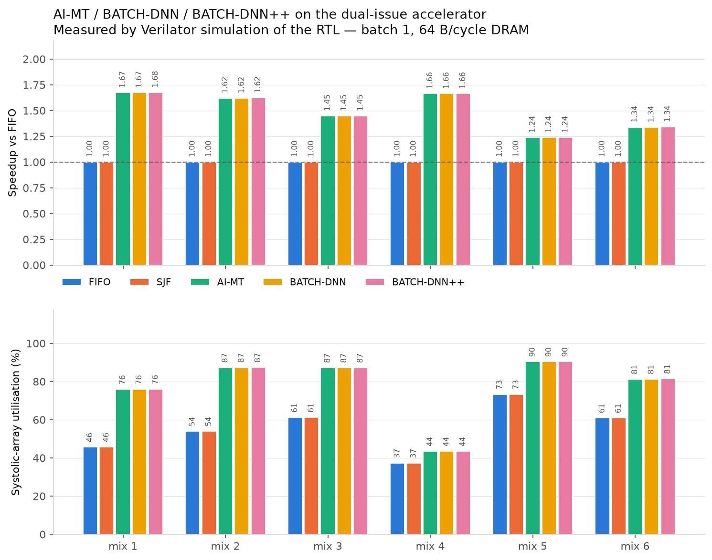
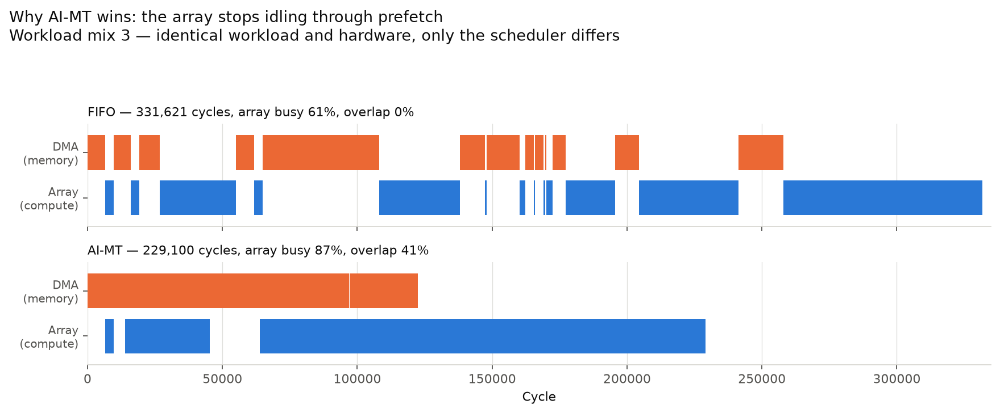
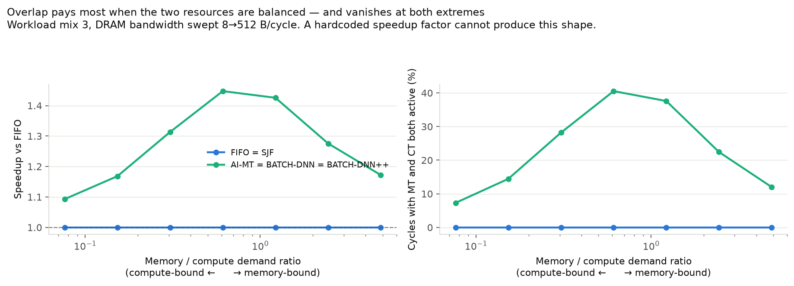
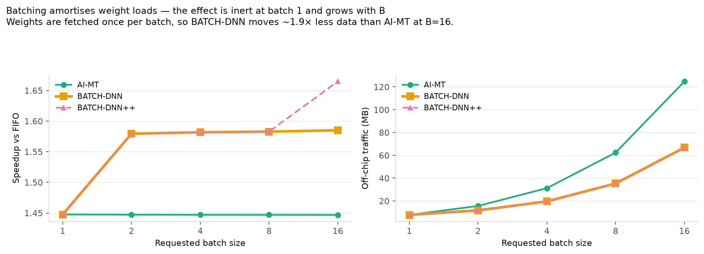
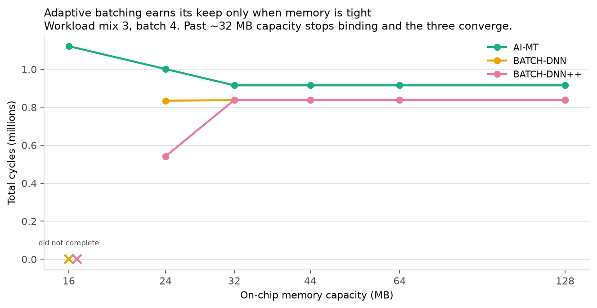

# AI-MT / BATCH-DNN / BATCH-DNN++ on real hardware — measured results

Every number in this report comes from **Verilator simulation of the RTL**
(`rtl/exec/` + `rtl/schedulers/`). No scheduler carries a hand-written speedup
factor. Reproduce with:

```bash
cd sim_framework && source .venv/bin/activate
./tb/exec/build_exec.sh                      # build the simulator
PYTHONPATH=. python scripts/run_aimt_eval.py --exp all
PYTHONPATH=. python scripts/gen_aimt_figs.py
```

---

## 1. Why the old framework showed no benefit

The three DNN-aware schedulers were **already implemented correctly** — each
drives an independent `mt_valid` and `ct_valid`, as the papers require. Three
things downstream destroyed that parallelism before it could pay:

| # | Where | What it did |
|---|---|---|
| 1 | `unified_scheduler_wrapper.sv` | Collapsed the concurrent `{mt_valid, ct_valid}` pair into a single tagged union that gives the CT priority — only one could be seen per cycle |
| 2 | `multi_dnn_top.sv:298-338` | Single-issue run-to-completion dispatch FSM (`D_IDLE → D_RUN → D_WAIT_DONE`), one task held until it retired |
| 3 | `single_dnn_top.sv:409-413` | `S_MEM → S_COMPUTE` strictly in sequence, so even within one layer the array idled through the entire memory phase |

Memory and compute could therefore never be in flight together — the one thing
AI-MT exists to do. A fourth issue made the benefit unmeasurable even in
principle: `software_ref.estimate_cycles` is a pure compute formula and
`bytes_loaded` was never converted into cycles, so **memory cost zero time**.
Hiding a zero-cost operation saves nothing.

The measured consequence was all five schedulers landing within one cycle of
each other (13,412 vs 13,413), while `run_full_eval.py`'s Exp 5 charts asserted
a 26–48% speedup from a hardcoded `SCHEDULER_MODEL` lookup table.

## 2. What was built

New RTL in `rtl/exec/`, all synthesisable:

| Module | Role |
|---|---|
| `dram_model.sv` | Bandwidth- and latency-limited off-chip responder. Gives memory a real time cost: `latency + bytes/bandwidth`. Both knobs are runtime inputs. |
| `mt_engine.sv` | Memory Task engine — owns the off-chip port. `bytes = weight + batch × ifmap` (weights fetched once per batch). |
| `ct_engine.sv` | Compute Task engine — owns the systolic array. `cycles = compute × batch + fill_drain`. |
| `multi_dnn_exec_top.sv` | **Dual-issue** top: two independent dispatch channels that can both launch in the same cycle, plus per-layer completion accounting. |

`unified_scheduler_wrapper.sv` gained concurrent `mt_*_o` / `ct_*_o`
passthroughs (the legacy tagged union is untouched, so `multi_dnn_top` still
works), and the on-chip capacity/balance parameters are now plumbed through so
they can be swept.

**The baseline is fair.** Basic schedulers (FIFO/SJF) run on the *same*
machine, same engines, same DRAM — through a serial MT→CT channel. That is not
a handicap: a FIFO scheduler emits one undifferentiated task stream and has no
notion of a memory task to overlap. They are also *not* required to respect
layer dependencies, which if anything favours the baseline.

**Runs that do not finish are rejected, not credited.** `stat_layers_completed`
counts distinct layers retired; any run that wedges is flagged `incomplete` and
dropped from the comparison (Exp E keeps and marks them, because "did not
complete" is the finding there).

## 3. RTL defects found and fixed

Building the machine exposed four real bugs in the schedulers. Each produced a
*fast but wrong* result — a short cycle count for a run that had silently
dropped part of the workload — which is why they had gone unnoticed.

| # | Scheduler | Defect | Symptom |
|---|---|---|---|
| 1 | BATCH-DNN, ++ | `prev_batch` / `prev_batch_reg` reset to 0 and written only inside the dispatch path, but `max_batch_size()` clamps to it | `feasible_b` pinned at 0 → CT path stalled forever; every MT ran, then deadlock |
| 2 | all three | OFMAP reserved but never released; the batching pair reserved it *twice* (MT `mem_req` **and** CT dispatch) | `avail_mem` drained monotonically until the balance check failed permanently |
| 3 | BATCH-DNN, ++ | `ct_cq_cnt` / `sct_cnt` used a raw `+1`/`-1` pair; a same-edge enqueue+pop lost the enqueue to last-assignment-wins | Layers stranded in the queue — BATCH-DNN finished 8 of 12 |
| 4 | BATCH-DNN++ | `layer_distance()` compares **global** layer indices, but `ct_current_layer[]` reset to 0 | Any DNN whose first layer index > `MAX_LAYER_DISTANCE` (5) was throttled forever — an entire network never ran |

Fix 3 is the "finding F7" pattern that had already been applied to `mt_cq` but
never extended to the other two queues. A fifth issue was a *parameter*, not a
bug: `MAX_DNNS` defaults to 4 while Workload mix 6 co-schedules six networks,
so per-DNN state was indexed out of range; the testbench now elaborates with
`MAX_DNNS = 8`.

Guarded by `tb/unit/test_dnn_scheduler_exec.py` (10 tests, skips cleanly when
the simulator is not built).

## 4. Results

### A — Scheduler comparison (batch 1, 64 B/cycle DRAM)



| Mix | mem/compute | FIFO | AI-MT | Speedup | Array util FIFO → AI-MT |
|---|---|---|---|---|---|
| 1 | 1.19 | 129,702 | 77,496 | **1.67×** | 46% → 76% |
| 2 | 0.85 | 156,383 | 96,531 | **1.62×** | 54% → 87% |
| 3 | 0.61 | 331,621 | 229,100 | **1.45×** | 61% → 87% |
| 4 | 2.29 | 253,632 | 152,393 | **1.66×** | 37% → 44% |
| 5 | 0.33 | 182,369 | 147,306 | **1.24×** | 73% → 90% |
| 6 | 0.62 | 353,564 | 264,389 | **1.34×** | 61% → 81% |

All six mixes complete on every scheduler, no rejections.

### B — The mechanism



FIFO strictly alternates DMA and array (0% overlap, visible bubbles). AI-MT
runs both engines together — 41% of cycles have a memory task and a compute
task in flight simultaneously, and the array stops idling through prefetch.

### C — Speedup vs arithmetic intensity (the falsifiable test)



Sweeping DRAM bandwidth 8→512 B/cycle moves the mix from memory-bound to
compute-bound. Speedup **peaks where the two resources are balanced** and
decays in both directions:

| mem/compute | 4.88 | 2.44 | 1.22 | 0.61 | 0.31 | 0.15 | 0.08 |
|---|---|---|---|---|---|---|---|
| AI-MT speedup | 1.17 | 1.28 | 1.43 | **1.45** | 1.31 | 1.17 | 1.09 |
| overlap % | 12.0 | 22.4 | 37.6 | **40.5** | 28.2 | 14.4 | 7.3 |

This is the result that proves the numbers are not a lookup table: a hardcoded
1.26 cannot bend. Both limits behave correctly — nothing to hide when
compute-bound, nothing to hide *behind* when memory-bound.

### D — Batch sweep



Batching is **inert at B=1** (all three identical, reproducing the original
golden observation) and grows with B. At B=16 BATCH-DNN moves 66.8 MB against
AI-MT's 124.8 MB — **1.87× less off-chip traffic for identical compute**.
BATCH-DNN++ separates from BATCH-DNN at B=16 (1.67× vs 1.59×) where batch
slicing engages.

### E — On-chip capacity



At 24 MB, BATCH-DNN++ needs 541,614 cycles against AI-MT's 1,001,330 — **1.85×**
— because adaptive batching adapts and AI-MT cannot. Past ~32 MB capacity stops
binding and the three converge. Below 24 MB the batching schedulers deadlock
(see limitations).

## 5. Limitations — read before quoting these numbers

- **Compute is modelled as occupancy, not arithmetic.** `ct_engine` holds the
  array for the cycle count the scheduling table declares; it does not perform
  MACs. Functional correctness of the datapath is covered by the existing
  golden tests, not by this harness. These are *scheduling* results.
- **`compute_cycles` comes from `software_ref.estimate_cycles`**, the
  framework's existing analytical array model — a rank score, per
  `GOLDEN_CHECK_SUMMARY.md` §7, not a validated cycle prediction. Speedup
  *ratios* are far more trustworthy than absolute cycle counts.
- **BATCH-DNN / ++ deadlock below ~24 MB at batch 4.** Sub-batch splitting acts
  on the CT dispatch path only; the MT path still requires the *full* batch
  footprint to fit before it will start, so it cannot split its way out of a
  buffer smaller than one full-batch layer. AI-MT degrades gracefully there.
  This is a real limitation of the implementations, left unfixed and reported
  rather than hidden.
- **RR (select 3) is excluded** — it retires only 10–11 of 12 layers because the
  legacy round-robin pointer can re-select an already-dispatched slot. A
  pre-existing defect in the basic family, unrelated to this work.
- **FIFO dispatches 13 tasks for 12 layers** (one redundant re-dispatch). It is
  counted honestly in its cycle total, so the baseline is if anything slightly
  pessimistic.
- **No Vivado.** Area/power/Fmax for the new engines are not measured; only
  cycles are.
- `run_full_eval.py`'s Exp 5 still uses the hardcoded `SCHEDULER_MODEL`. It was
  left untouched so the existing report keeps building; these results supersede
  it and live in a separate tree.
