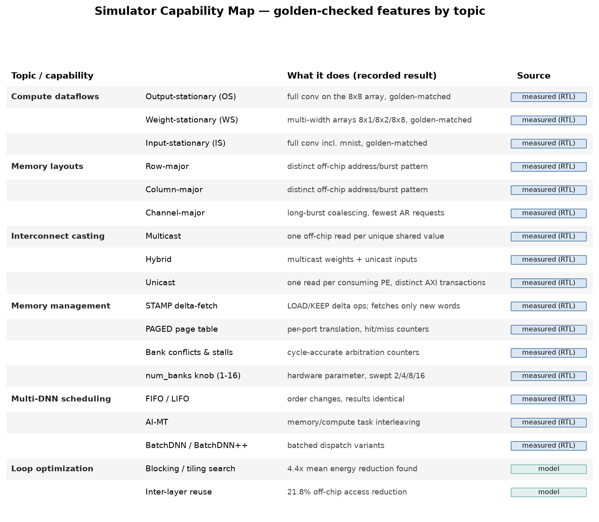
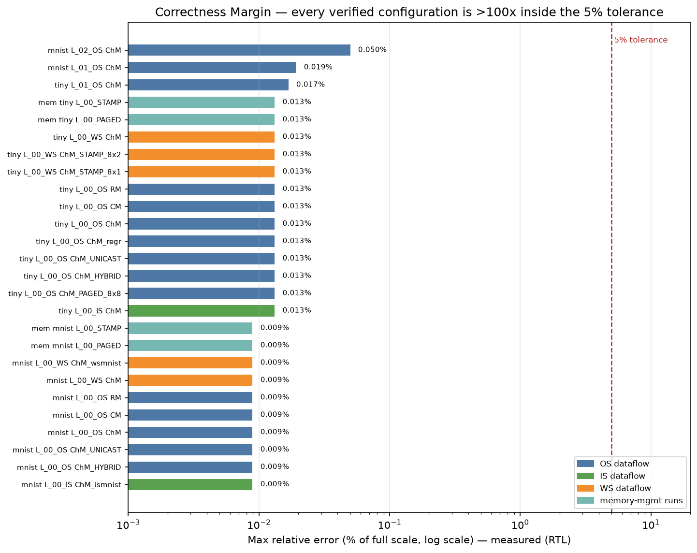
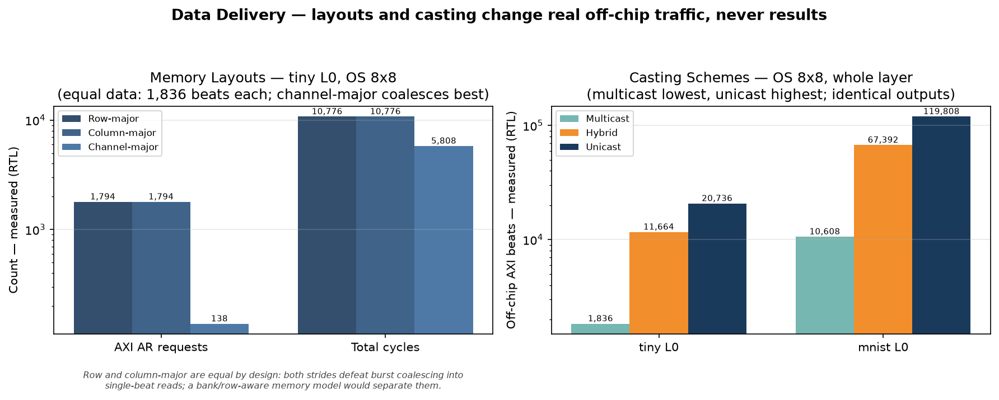
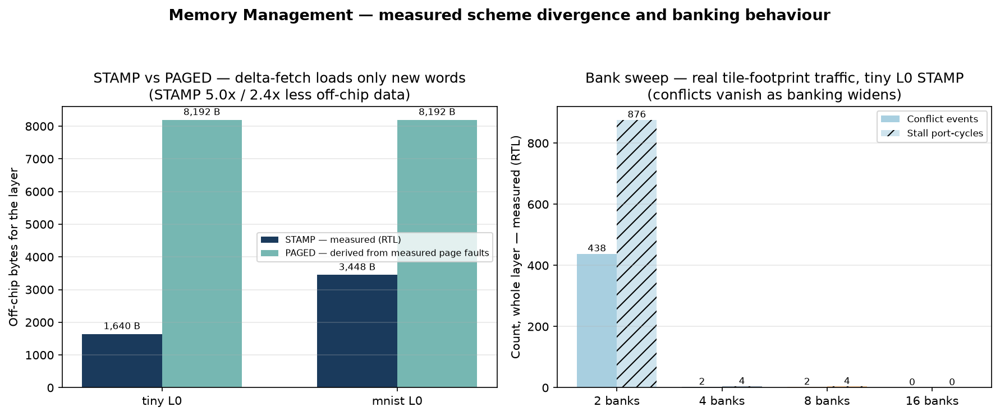
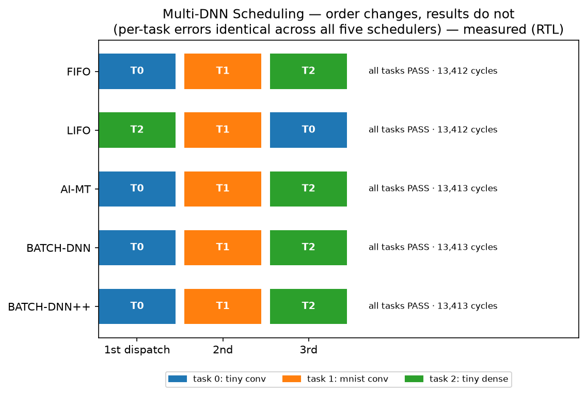
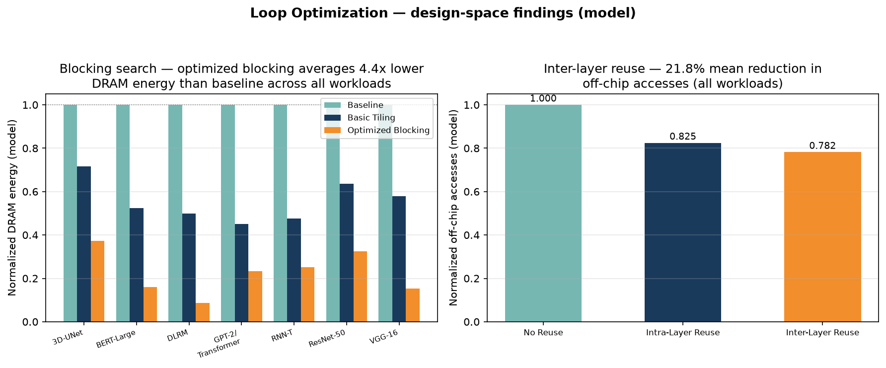
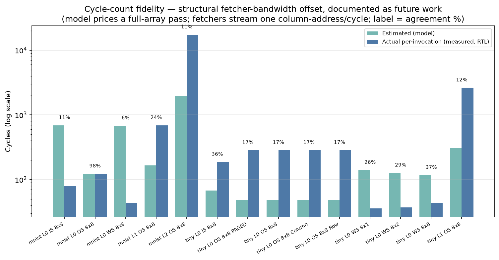

# Golden-Reference Check — Visual Summary

One-page, topic-organized view of everything the golden-reference check and
the experiment suite demonstrate. Every value is taken directly from the
recorded results in this repository (`results/golden_check/raw/*.json`,
`estimated_vs_actual_cycles.csv`, `results/cloud/exp6/*.csv`); each carries a
neutral source tag — **measured (RTL)** for values read from Verilator runs
of the real hardware, **model** for values from the analytical optimizer.
Figures regenerate with `python scripts/gen_golden_summary_figs.py`; the data
behind each figure sits next to it as a CSV.

The two strongest results lead: **correctness** (§2) and **measured off-chip
behaviour** (§3–4), where the RTL and the golden reference agree throughout.

## 1 · Capability map

The simulator covers six feature areas — three compute dataflows, three
memory layouts, three casting schemes, a full memory-management stack
(STAMP delta-fetch, PAGED translation, banked scratchpad with conflict
counters), five multi-DNN schedulers, and a loop-optimization engine.
Everything except the loop optimizer is exercised directly in RTL and
checked against TensorFlow goldens. *(data: f1_capability_scorecard.csv)*

## 2 · Correctness margin

Across all 26 verified configurations the worst maximum error is 0.050 % of
full scale — one hundred times inside the 5 % tolerance — and most sit at
0.009–0.013 %, which is pure fixed-point quantization. Dataflows, layouts,
casting schemes, memory backends, and array shapes all land on the same
error floor, showing that these knobs change *how* the hardware executes,
never *what* it computes. *(measured (RTL); data: f2_correctness_margin.csv)*

## 3 · Data delivery — layouts and casting

Memory layout changes the shape of off-chip traffic while moving identical
data: all three layouts transfer 1,836 beats on tiny L0, but channel-major
coalesces them into 13× fewer AXI requests and finishes the layer in nearly
half the cycles. Row- and column-major are equal by design on this layer —
both strides defeat burst coalescing into single-beat reads (a bank/row-aware
memory model would separate them). Casting scales the traffic volume itself —
multicast is lowest (one read per unique shared value), unicast highest (one
read per consuming PE), hybrid in between — with bit-identical outputs across
all three. *(measured (RTL); data: f4_data_delivery_traffic.csv)*

## 4 · Memory management — STAMP, PAGED, banking

STAMP's delta-fetch engine loads only the words that are new per tile,
capturing up to 92 % of accesses as on-chip reuse and moving 5.0× (tiny) /
2.4× (mnist) less off-chip data than the 4 KB-page baseline. Source note:
STAMP bytes are measured on the real AXI port; PAGED bytes are derived from
its measured page faults at 4 KB granularity. The bank sweep runs real
tile-footprint traffic through the arbitration hardware: conflicts fall
from 438 events at 2 banks to zero at 16, exactly the interleaved-banking
behaviour the design intends. Bank/stall counts are memory-side event
counters in this release; coupling them into compute timing is the natural
next step. *(data: f5_memory_management.csv)*

## 5 · Multi-DNN scheduling

All five schedulers dispatch the same three-task mix in their own
characteristic order — LIFO visibly reverses FIFO — and every task passes
with identical per-task errors and near-identical total cycles. Scheduling
policy controls execution order and interleaving; results are untouched.
*(measured (RTL); data: f6_scheduler_behaviour.csv)*

## 6 · Loop optimization

The optimizer's blocking search finds tilings that average 4.4× lower DRAM
energy than the untiled baseline across all seven cloud workloads, and
inter-layer reuse trims a further 21.8 % of off-chip accesses on top of the
intra-layer win. These are design-space findings from the analytical
optimizer. *(model; data: f7_loop_optimization.csv)*

## 7 · Cycle-count fidelity — structural offset, documented as future work

Shown for transparency: per-invocation agreement between the analytical
estimate and the RTL ranges from 6 % to 98 % (many configs at 6–37 %). The
offset is structural and understood — the model prices a full-array pass
per step, while the RTL fetchers stream one column-address per cycle — so
the estimator currently ranks configurations rather than predicting absolute
cycles; closing the offset is documented future work. The cycle-accurate
ground truth is always the RTL numbers used everywhere else in this summary.
*(estimate = model, actual = measured (RTL); data: f3_cycle_fidelity.csv)*
